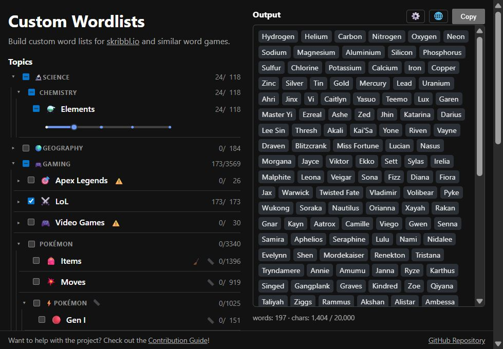

# Custom Wordlists

Build your own custom word lists for **[skribbl.io](https://skribbl.io)**, Codenames, and other word-based games — pick topics, tune the "fame ruler" based on your Group's knowledge on the topic, and copy a ready-to-paste list.

**▶ Live: <https://trummler12.github.io/custom-wordlists/>**



## What can you do?

- **Topics & groups** — browse a category tree, select whole topics or individual groups.
- **Fame depth** — a slider per group includes only the top-N fame tiers, so you can keep a list to just the iconic entries or go all the way into the deep cuts.
- **Name forms** — entries with a short/long name (e.g. *Cartman* / *Eric Cartman*) can be emitted as short, long, or both at once.
- **Languages** — pick which language the lists come out in and, as a separate setting, which one the app itself speaks (eleven each, Chinese counting twice for its two scripts). Entries fall back to English where a translation isn't there yet, and the row says so with a ⚠️.
- **Per-list overrides** — put a single list back to English while the rest stay in your language, or read Japanese lists as romaji and Spanish ones in their Latin American forms.
- **What a list leaves out** — a 🧹 panel names the families a list filters out (numbered junk, things nobody could draw) and hands any of them back if you want them.
- **skribbl-ready output** — de-duplicated, with live word/character counts and the skribbl limits checked for you.

### Progress

The tool itself already does what it needs to; the word lists, however, are where we heavily depend on **help from the community** — see [Contributing](#contributing) below.

[Here](docs/Topic-Progress.md) is **every topic planned** so far and how far along it is (in English — other languages trail behind).

### Future plans

The obvious next steps are finishing the **lists** that exist, adding the ones that don't, and supporting more languages.

[Here](docs/Language-Roadmap.md) is the rough order in which those **languages** are meant to arrive.

## Contributing

Contributions are very welcome, and **you don't need to write any code.** More and more lists are built by script from [Wikidata](https://www.wikidata.org/), in every language at once, so:

- **Improve the data on Wikidata (recommended).** Each topic built from it has a [coverage page](https://trummler12.github.io/custom-wordlists/coverage/sports) showing which names are still missing per language. Every one added there reaches the lists with the next dump.
- **Propose a topic built from Wikidata**, ideally with a Query Builder link, via a [*Data source*](https://github.com/Trummler12/custom-wordlists/issues/new?template=1-data-source.yml) issue.
- **Hand-written lists** are still welcome for topics Wikidata can't carry, but they are the costly route for everyone.

See **[CONTRIBUTING.md](CONTRIBUTING.md)** for the details.

## Local development

```bash
npm install
npm run dev        # dev server (http://localhost:5173)
npm run build      # production build => dist/
npm run validate   # check data/topics/** against the schema
npm run check      # type-check the frontend
npm test           # unit tests — CI runs this as its own gate
```

## How word lists are structured

Each topic is one JSON file under [`data/topics/**`](https://github.com/Trummler12/custom-wordlists/tree/main/data/topics), described by [`schema/topic.schema.json`](schema/topic.schema.json). Entries are usually built from three base forms:

- a **plain string** — `"Mr. Mackey"` — when it reads the same in every language & variant;
- a **`{short, long}` name pair** — `{"short": "Cartman", "long": "Eric Cartman"}` — for entries with both a common and a full name;
- a **language map** — `{"en": "Chef", "de": "Chefkoch"}` — for entries that differ between languages.

In rare cases these forms combine: a language map may wrap around only the part that actually differs from English, so a name pair whose long form translates becomes  
`{"short": "Jesus", "long": {"en": "Jesus Christ", "de": "Jesus Christus"}}`.

See [`data/topics/animation/south-park/characters.json`](data/topics/animation/south-park/characters.json#L19) for all of them in one file. The manifest the app loads (`data/index.json`) is generated by the `build:index` step, which both `npm run dev` and `npm run build` run first.

Two further keys say something by being **absent**, which is worth knowing before editing a file by hand:

- a **variant tag** — `ja-Latn` (romaji), `es-419` (Latin American Spanish) — is written only where the variant spells a name differently, so no key means "the same as the language it varies from";
- **`?`** lists the languages an entry has no name in *at all*. It is needed because a missing key already means "the same as English" — without it, a bulk import that stopped halfway would be asserting the English word as every other language's.

## Tech

Svelte 5 (runes) · Vite · TypeScript, deployed as a static site to GitHub Pages.

## License

The code is [MIT](LICENSE).

The word lists are collections of **names** — characters, creatures, places and the like — compiled from public sources: more and more of them from [Wikidata](https://www.wikidata.org/) (CC0), others from sources such as fandom wikis; no descriptions or other prose is copied from them. Ideally each topic file names its own sources in its `sources` field, and whoever compiled it in `credits` — that part is still work in progress. Many lists are only sketched out so far, with no source worth naming yet. If you hold rights to something here and would rather it weren't, open an issue and it comes out.
